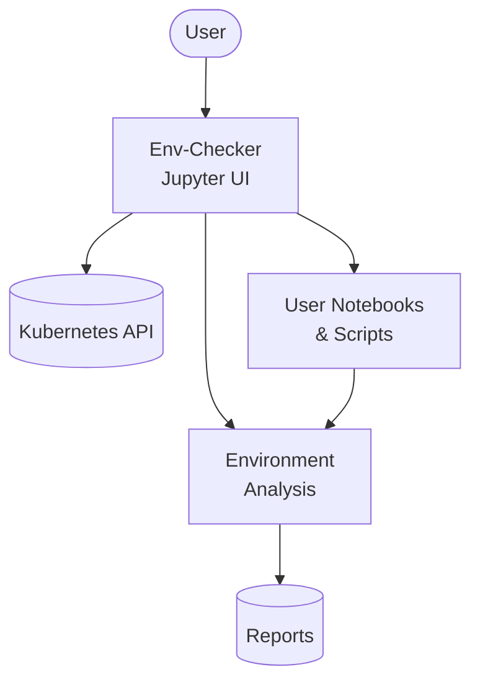

# Qubership Environment Checker

[](https://github.com/Netcracker/qubership-env-checker/actions/workflows/build.yaml)
[](https://github.com/Netcracker/qubership-env-checker/pkgs/container/qubership-env-checker)
[](https://github.com/Netcracker/qubership-env-checker/releases)
[](docs/InstallationGuide.md)

An independent microservice designed to validate Kubernetes or OpenShift environments in the cloud. Built on Jupyter ecosystem (JupyterLab + JupyterHub), this environment checker inspects infrastructure, Kubernetes entities, labels, annotations, variables, and more. It generates detailed reports that can be sent to storage or monitoring systems for identifying and troubleshooting environment issues.

## Features

- **Environment Validation**: Comprehensive validation of Kubernetes and OpenShift environments
- **Infrastructure Inspection**: Analyze Kubernetes entities, labels, annotations, and variables
- **Detailed Reporting**: Generate comprehensive reports for troubleshooting and monitoring
- **Real-time Debugging**: Assist in debugging DEV and QA environments in real-time
- **Jupyter Integration**: Web-based interface (JupyterLab + JupyterHub) for interactive environment analysis
- **Flexible Deployment**: Support for standalone, Job, and CronJob execution modes
- **Authentication Integration**: Optional Keycloak/IDP integration for secure access
- **Cloud-Native**: Designed specifically for cloud Kubernetes deployments

## Requirements

| Component  | Requirement | Version |
|------------|-------------|---------|
| Kubernetes | Mandatory   | 1.21+   |
| Helm       | Mandatory   | 3.0+    |
| Docker     | Optional    | 20.0+   |

> **Note**: This service installs kubectl v1.32 internally. Ensure compatibility with your cluster version.

## Installation

### Quick Start

Deploy env-checker to your Kubernetes cluster using Helm:

```bash
# Create namespace and deploy
helm upgrade --install qubership-env-checker \
    --namespace=env-checker \
    --create-namespace \
    --set NAMESPACE=env-checker \
    --set CLOUD_PUBLIC_HOST=your-cluster-domain.com \
    charts/env-checker
```

### Required RBAC Configuration

Create the necessary ClusterRoleBinding for the service account:

```yaml
apiVersion: rbac.authorization.k8s.io/v1
kind: ClusterRoleBinding
metadata:
  name: view-for-env-checker
subjects:
  - kind: ServiceAccount
    name: env-checker-sa
    namespace: env-checker  # Replace with your namespace
roleRef:
  apiGroup: rbac.authorization.k8s.io
  kind: ClusterRole
  name: view
```

### Access the UI

**Port Forwarding:**

```bash
# Without OAuth2 (default)
kubectl port-forward svc/env-checker 8888:8888 -n env-checker

# With OAuth2 (if OPS_IDP_URL is configured)
kubectl port-forward svc/env-checker 8080:8080 -n env-checker
```

Then access: <http://localhost:8888> (without OAuth2) or <http://localhost:8080> (with OAuth2)

**Via Ingress:** Access through configured ingress URL using the token set via `ENVIRONMENT_CHECKER_UI_ACCESS_TOKEN` parameter

## Usage

### Interactive Mode

Access the Jupyter interface through the web UI to run environment checks interactively. The service provides both JupyterLab and JupyterHub functionality.

### Job Mode

Execute one-time environment checks:

```bash
helm upgrade qubership-env-checker charts/env-checker \
    --set ENVIRONMENT_CHECKER_JOB_COMMAND="your-custom-command-here"
```

### CronJob Mode

Schedule recurring environment validations:

```bash
helm upgrade qubership-env-checker charts/env-checker \
    --set ENVIRONMENT_CHECKER_CRON_JOB_COMMAND="your-custom-command-here" \
    --set ENVIRONMENT_CHECKER_CRON_SCHEDULE="0 */1 * * *"
```

> **Note**: Create your own notebooks and scripts in the Jupyter interface to define environment checks. No pre-defined notebooks are included in the repository.

## Configuration

### Essential Parameters

| Parameter | Required | Default | Description |
|-----------|----------|---------|-------------|
| `CLOUD_PUBLIC_HOST` | **Mandatory** | `qubership` | Public host for Kubernetes elements like Ingress |
| `NAMESPACE` | **Mandatory** | `default` | Target namespace for deployment |
| `SERVICE_NAME` | Optional | `env-checker` | Microservice name |
| `APPLICATION_NAME` | Optional | `env-checker` | Application name for labeling |
| `ENVIRONMENT_CHECKER_UI_ACCESS_TOKEN` | Optional | - | UI access token (if not set, random token generated) |

### Job/CronJob Parameters

| Parameter | Required | Default | Description |
|-----------|----------|---------|-------------|
| `ENVIRONMENT_CHECKER_JOB_COMMAND` | Optional | - | Command for one-time job execution |
| `ENVIRONMENT_CHECKER_CRON_JOB_COMMAND` | Optional | - | Command for scheduled execution |
| `ENVIRONMENT_CHECKER_CRON_SCHEDULE` | Optional | `0 0 */12 * *` | Cron schedule for recurring jobs |

### Authentication Parameters (Optional)

| Parameter | Description |
|-----------|-------------|
| `OPS_IDP_URL` | Keycloak URL for IDP integration |
| `ENVCHECKER_KEYCLOACK_REALM` | IDP realm name |
| `ENVCHECKER_KEYCLOACK_CLIENT_ID` | IDP client ID |
| `ENVCHECKER_KEYCLOACK_CLIENT_SECRET` | IDP client secret |

### Security Parameters

| Parameter | Required | Default | Description |
|-----------|----------|---------|-------------|
| `READONLY_CONTAINER_FILE_SYSTEM_ENABLED` | Optional | `false` | Enable read-only container filesystem |

### OpenShift Configuration

For OpenShift deployments, set:

```yaml
CHOWN_HOME: "yes"
CHOWN_HOME_OPTS: "-R"
```

See the complete parameter reference in the [Installation Guide](docs/InstallationGuide.md).

## API Reference

The env-checker utilizes the Jupyter Server API (v2.0+) without extensions. For detailed API documentation, refer to the [Jupyter Server API documentation](https://jupyter-server.readthedocs.io/en/latest/developers/rest-api.html).

## Architecture

### System Overview



The env-checker operates as a containerized microservice within Kubernetes, providing:

- **Web Interface**: Jupyter-based UI (JupyterLab + JupyterHub) for interactive environment analysis
- **Kubernetes Integration**: Direct API access via service account with cluster-wide view permissions  
- **Flexible Execution**: Support for interactive, job-based, and scheduled execution modes
- **Reporting Pipeline**: Automated report generation and distribution to monitoring systems

## Testing

### Sanity Check

1. Access the env-checker UI via ingress or port-forwarding
2. Log in using the configured access token
3. Verify UI availability and basic functionality

### Smoke Test

Verify Kubernetes API access from within the Jupyter terminal:

```bash
kubectl get ns
```

**Note**: If this command fails, verify:

1. The ClusterRoleBinding configuration
2. Service account token mounting (check `automountServiceAccountToken` setting)
3. Pod security context and RBAC permissions

For comprehensive testing procedures, see the [Installation Guide](docs/InstallationGuide.md#tests).

## Contributing

Please read [CONTRIBUTING.md](CONTRIBUTING.md) for details on our code of conduct and the process for submitting pull requests.

See also:

- [Code of Conduct](CODE-OF-CONDUCT.md)
- [Security Policy](SECURITY.md)

## License

This project is dual-licensed:

- [Apache License 2.0](LICENSE-APACHE)
- [MIT License](LICENSE)

---

For detailed installation instructions, hardware requirements, and advanced configuration, see the [Installation Guide](docs/InstallationGuide.md).
